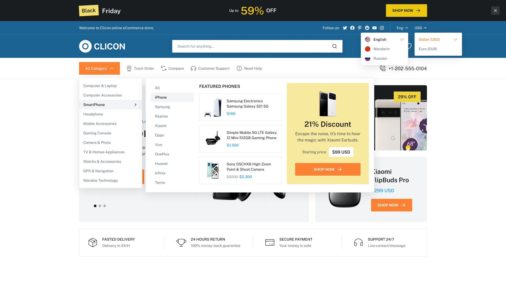

# ShopSphere

ShopSphere is a full-stack e-commerce platform designed to provide a seamless shopping experience for customers and a powerful management system for administrators. The project is built using modern web technologies to ensure scalability, maintainability, and high performance.

---

## 🚧 **Project Status: In Progress**  
This project is currently under development. Features are being implemented, and updates are made regularly. Contributions and feedback are welcome!

---

## 🔥 Features (Planned and Implemented)

- **User Authentication**: Secure login and registration for users and admins.
- **Product Management**: Add, update, delete, and view product details.
- **Shopping Cart**: Add items, manage quantities, and checkout.
- **Order Management**: Place, track, and manage orders.
- **Search & Filtering**: Find products with various filters.
- **Responsive Design**: Optimized for all devices.
- **Admin Dashboard**: Tools for managing the platform effectively.

---

## 💻 Technologies Used

### Backend
- **NestJS**: For building scalable server-side applications.
- **GraphQL**: To enable efficient data fetching.
- **MongoDB**: As the primary database.
- **Prisma**: For ORM.

### Frontend
- **React**: To create a dynamic user interface.
- **Apollo Client**: For GraphQL integration.
- **CSS Modules**: For component-based styling.

### DevOps
- **Docker**: For containerization.
---
## 📸 Preview

